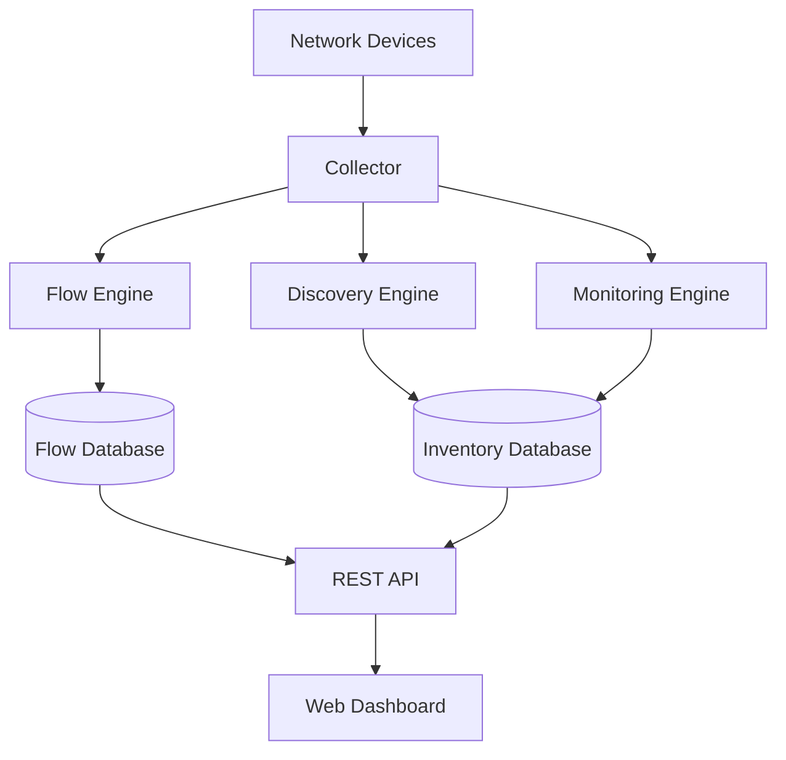

# System Overview

## Overview

TRS FlowVision is designed as a modular monolith application.

Each module has a single responsibility and communicates through well-defined interfaces.

The system is designed to evolve gradually without requiring major architectural changes.

---

# High-Level Architecture

---

# Components

## Collector

Responsible for receiving information from network devices.

Supported protocols (planned):

- NetFlow
- IPFIX
- SNMP
- LLDP
- CDP
- Syslog

---

## Flow Engine

Processes flow records and prepares them for storage and analytics.

---

## Discovery Engine

Discovers devices and network relationships.

---

## Monitoring Engine

Collects operational metrics such as CPU, memory, interface utilization and errors.

---

## REST API

Provides a single interface between backend services and the frontend application.

---

## Web Dashboard

Displays topology, flow statistics, alerts and monitoring data through a modern web interface.
